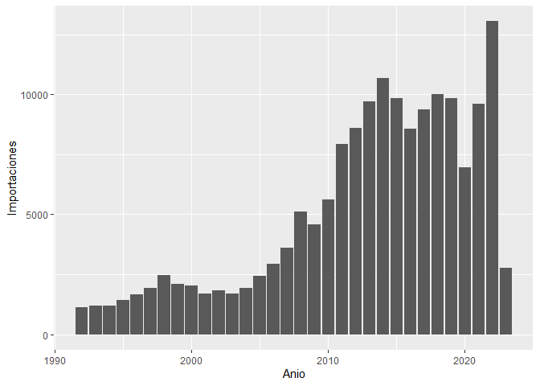
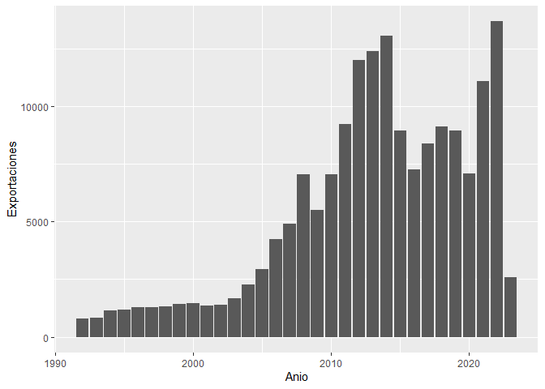

Graficos de barras
================
Teddy Alvarez Zarate
2023-05-25

``` r
library(tidyverse)
```

    ## ── Attaching packages ─────────────────────────────────────── tidyverse 1.3.2 ──
    ## ✔ ggplot2 3.4.0      ✔ purrr   0.3.5 
    ## ✔ tibble  3.1.8      ✔ dplyr   1.0.10
    ## ✔ tidyr   1.2.1      ✔ stringr 1.5.0 
    ## ✔ readr   2.1.3      ✔ forcats 0.5.2 
    ## ── Conflicts ────────────────────────────────────────── tidyverse_conflicts() ──
    ## ✖ dplyr::filter() masks stats::filter()
    ## ✖ dplyr::lag()    masks stats::lag()

``` r
library(readxl)
setwd("~/Experto en ciencia de datos/Modulo 2/Proyecto fin de modulo 2/Graficos de barras")
datos <- read_excel("export_import.xlsx")
```

## Generando las graficas de barras para importaciones y exportaciones

Se han tomado en cuenta datos sobre las importacione y exportaciones de
Bolivia, desde el año 1992 al 2023(p), medido en millones de usd

``` r
ggplot(datos, aes(Anio, Importaciones))+
geom_bar(stat = "identity")
```

<!-- -->

``` r
ggplot(datos, aes(Anio, Exportaciones))+
geom_bar(stat = "identity")
```

<!-- -->
