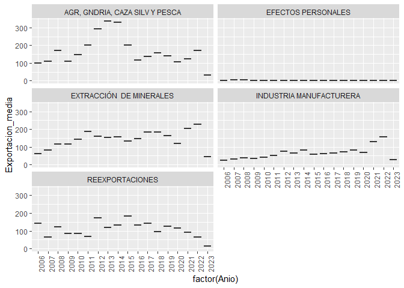

Grafico boxplot
================
Teddy Alvarez Zarate

``` r
library(tidyverse)
```

    ## ── Attaching packages ─────────────────────────────────────── tidyverse 1.3.2 ──
    ## ✔ ggplot2 3.4.0      ✔ purrr   0.3.5 
    ## ✔ tibble  3.1.8      ✔ dplyr   1.0.10
    ## ✔ tidyr   1.2.1      ✔ stringr 1.5.0 
    ## ✔ readr   2.1.3      ✔ forcats 0.5.2 
    ## ── Conflicts ────────────────────────────────────────── tidyverse_conflicts() ──
    ## ✖ dplyr::filter() masks stats::filter()
    ## ✖ dplyr::lag()    masks stats::lag()

``` r
library(readxl)
setwd("~/Experto en ciencia de datos/Modulo 2/Proyecto fin de modulo 2")
```

## Graficos de barras

Para contruir el grafico de cajas, se tomo en cuenta los datos
correspondientes a las exportacione de Bolivia

``` r
datos_exp <- read_excel("exportaciones.xlsx")
datos_exp <- datos_exp%>%
mutate(Sector=fct_recode(Sector, "AGR, GNDRIA, CAZA SILV Y PESCA"= "AGRICULTURA, GANADERÍA, CAZA SILVICULTURA Y PESCA"))
```

## Limpiando datos

Se procedio a reemplazar los datos NA por 0 (cero)

``` r
datos_exp1 <- datos_exp%>%
mutate(Sector=as.factor(Sector))

datos_exp1 <- datos_exp1%>%
mutate_all(~replace(., is.na(.),0))
```

    ## Warning in `[<-.factor`(`*tmp*`, list, value = 0): invalid factor level, NA
    ## generated

``` r
datos_exp1 <- datos_exp1%>%
    group_by(Anio, Sector)%>%
summarise(Exportacion_media=mean(Valor), n=n(),.groups='drop')

datos_exp1<-datos_exp1%>%
  filter(Anio>2005)
```

``` r
ggplot(datos_exp1, aes(factor(Anio), Exportacion_media, fill=Sector))+
geom_boxplot(show.legend = FALSE)+
facet_wrap(~Sector, ncol=2, nrow=5)+
theme(legend.position = "bottom", axis.text.x = element_text(angle = 90, hjust = 1))
```

<!-- -->
