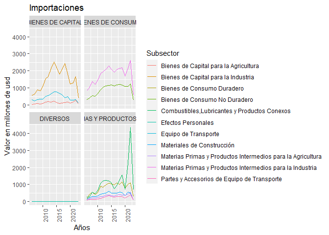

Graficos de lineas
================
Teddy Alvarez Zarate
2023-05-25

``` r
library(tidyverse)
```

    ## ── Attaching packages ─────────────────────────────────────── tidyverse 1.3.2 ──
    ## ✔ ggplot2 3.4.0      ✔ purrr   0.3.5 
    ## ✔ tibble  3.1.8      ✔ dplyr   1.0.10
    ## ✔ tidyr   1.2.1      ✔ stringr 1.5.0 
    ## ✔ readr   2.1.3      ✔ forcats 0.5.2 
    ## ── Conflicts ────────────────────────────────────────── tidyverse_conflicts() ──
    ## ✖ dplyr::filter() masks stats::filter()
    ## ✖ dplyr::lag()    masks stats::lag()

``` r
library(readxl)
setwd("~/Experto en ciencia de datos/Modulo 2")
datos <- read_excel("importaciones.xlsx")
```

## Generando graficos de lineas

Se han tomado en cuenta las variables Años y Valor de las importaciones
y se los ha separado por sectores de importacion

``` r
datos1 <- filter(datos, Anio>2005)

ggplot(datos1, aes(Anio, Valor, col=Subsector))+
geom_line()+
facet_wrap(~Sector, ncol=2, nrow=2)+
labs(title = "Importaciones", x="Años", y="Valor en millones de usd")+theme(axis.text.x = element_text(angle = 90, hjust = 1))
```

<!-- -->
